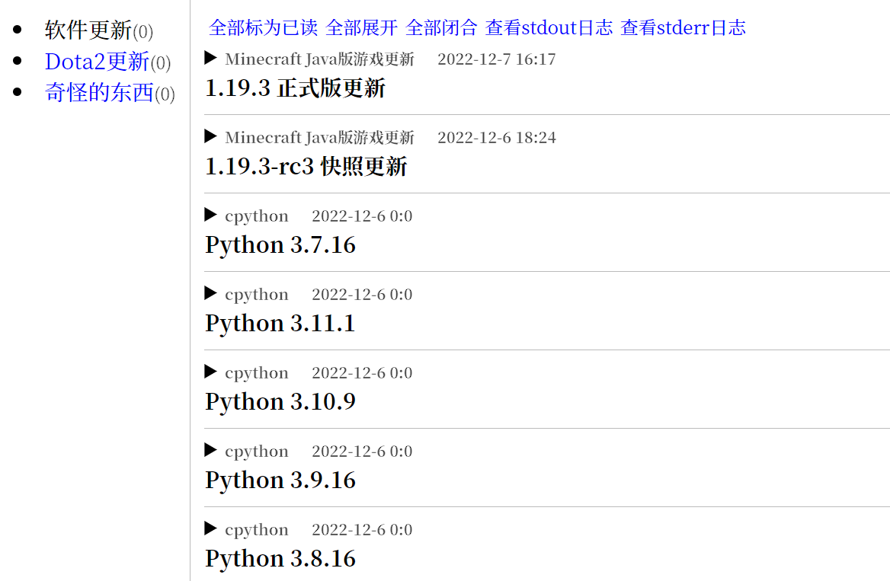

# 【rimo-rss-reader】莉沫酱RSS阅读器

最近我突然想入坑RSS，想要挑一款RSS阅读器，却怎么挑都挑不到趁手的。
它们有些是收费的、有些不开源、还有不能跨平台的，RSS阅读器怎么成了这个样子？

看来还是得我自己来写一个，让它们看看我的厉害！


## 莉沫酱RSS阅读器的好处

- 开源而且免费
- 跨平台，支持Windows、Linux、MacOS (我没Mac，不过应该也能用)
- 安装方便
- 是高性能的！


## 使用效果



简单就是美！


## 安装方法

首先你需要1个Python3.8以上版本，然后——

```sh
pip install git+https://github.com/RimoChan/rimo-rss-reader.git
```

这样就装好了。


## 使用方法

```sh
python -m rimo_rss_reader 你的配置文件路径
```

配置文件的格式可参考仓库里的[配置.yaml](./配置.yaml)。

然后用浏览器打开`http://127.0.0.1:23333/`就可以开始阅读了。


### 一些特殊的用法

- 我想在开机的时候后台启动

把那行命令直接放到你的开机启动项里就可以了。如果你是Windows用户，还需要把命令里的`python`改成`pythonw`。

- 可以放在服务器上吗？

可以，只需要在启动之前把配置里的`别的电脑也可以看`改成`True`。然后前端的URL就是你的服务器的IP地址加端口号。


## 结束

就这样，我要去订阅色色的女孩子了，大家88！
